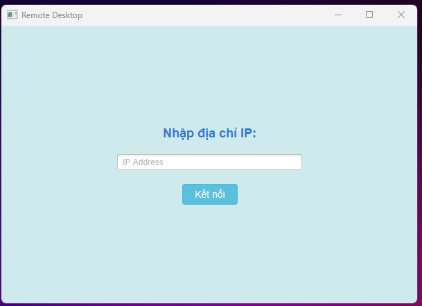
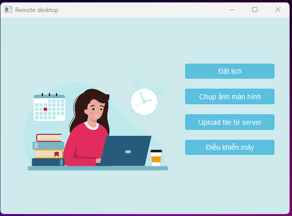
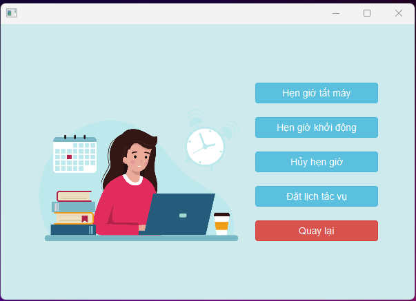
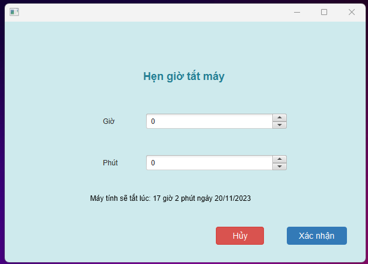
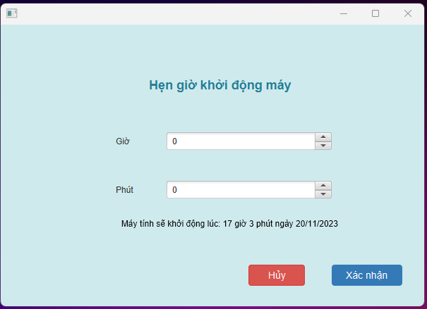
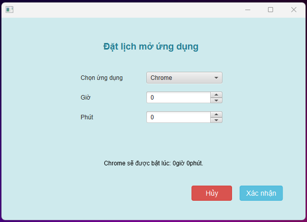
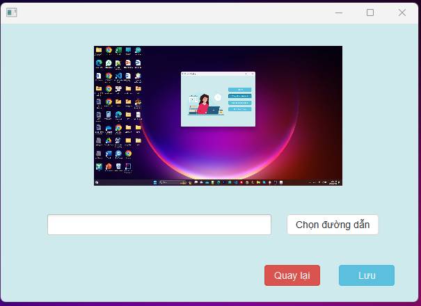
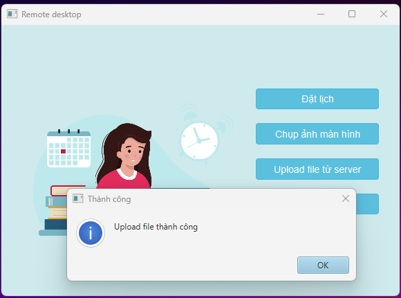
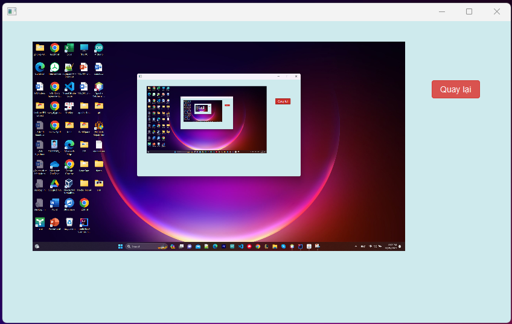

Chủ đề: Xây dựng ứng dụng điều khiển máy tính từ xa - Remote Desktop
1. Thông tin nhóm:
	- Phạm Hồng Phong - B20DCCN497
	- Trần Thị Thu Khanh - B20DCCN370
	- Nguyễn Thị Thu Trang - B20DCCN688
2.  Công nghệ sử dụng
	- Ngôn ngữ lập trình: Java
	- Công nghệ: JavaFX, TCP Socket, Multi Thread
3. Thư Viện Xử Lý
	- Java AWT, Robot: Để chụp ảnh màn hình.
	- Socket: Để thiết lập kết nối giữa client và server.
4. Giao diện:
   	- Giao diện kết nối server:
	
 	 

  	- Giao diện menu:
	
	 

 	- Giao diện menu đặt lịch:
	
	 
 	
	

 	- Giao diện chức năng hẹn thời gian tắt máy:
	
 	 
  
 	- Giao diện chức năng hẹn thời gian khởi động lại máy:
	
	 

 	- Giao diện chức năng hẹn lịch thực hiện tác vụ bất kỳ:
	
	 

	- Giao diện chức năng chụp ảnh màn hình:
	
	 

	- Giao diện chức năng upload file lên server:
	
	 

	- Giao diện chức năng điều khiển máy thời gian thực:
	
	 
5. Cài đặt môi trường:
	- Đảm bảo cài đặt JDK trên máy tính
6. Giao tiếp:
 	Server và client giao tiếp thông qua kết nối socket. Client gửi yêu cầu đến server, server xử lý yêu cầu và gửi kết quả trở lại client.
7. Kiến Trúc
	Ứng dụng được thiết kế theo kiến trúc Client-Server. Server lắng nghe yêu cầu từ client thông qua socket và thực hiện các chức năng tương ứng.
8. Các chức năng chính của ứng dụng:
 Khi máy client và server được kết nối với nhau thì máy client có thể điều khiển các hoạt động trên máy server:
	+ Truy cập và xem màn hình của một máy tính từ xa theo thời gian thực.
	+ Sử dụng chuột và bàn phím để thực hiện các thao tác trên màn hình máy tính được truy cập.
	+ Chụp và lưu ảnh màn hình của máy tính được truy cập từ xa.
	+ Hẹn thời gian tắt hoặc khởi động lại máy từ xa.
	+ Hủy hẹn giờ tắt hoặc khởi động lại.
	+ Download file từ server 
	+ Upload file lên server 
	+ Đặt lịch thực hiện 1 tác vụ bất kỳ ở trên máy remote.
	+ Tự động chụp và lưu ảnh màn hình khi 1 tác vụ được đặt lịch khởi động.
9. Triển khai:
	+ Chụp và lưu ảnh màn hình. (100%)
	+ Hẹn thời gian tắt hoặc khởi động lại máy. (100%)
	+ Hủy hẹn giờ tắt hoặc khởi động lại. (100%)
	+ Upload file lên server. (100%)
	+ Lập lịch thực hiện tác vụ cho máy remote.(100%)
	+ Upload file nén lên server. (100%)
	+ Xem màn hình hoạt động máy remote theo thời gian thực. (100%)
	+ Tự động chụp và lưu ảnh màn hình khi 1 tác vụ được bật theo lịch.(100%)
 	+ Đang cập nhật thêm....
# Lap_Trinh_Mang_PTIT_2023
